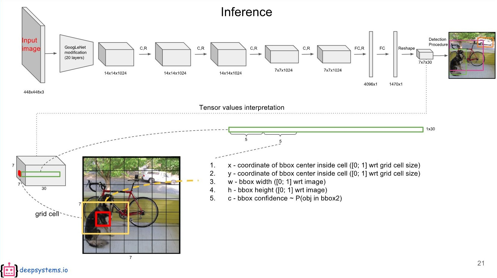

# Weekly Report

2018년 12월 10일 월요일 최태민

## Uncertainty in Deep Learning

#### 1. R-CNN & YOLO

현재 한 이미지에 하나의 숫자만 인식(기본적인 CNN)

실제 환경에서 적용(로봇을 이용한 서비스)하려면 다음과 같이 한 이미지에 여러개의 클래스(얼굴, 숫자 등)인식 필요

YOLO 논문과 자료 확인

{: width="100%" height="100%"}

#### 2. Example_1

YOLO는 Darknet framwork 에서 동작, tensorflow 로 구현한 얼굴 인식예제 확인 및 코딩하는 중

학습에 필요한 데이터셋은 다음과 같은 구조를 가짐

- Images
- Annotations
  - json 형식으로 얼굴이 두개 있다면, {"class_name":[[x_min, y_min, x_max, y_max], [150, 40, 170, 70]}
  - {: width="100%" height="100%"}

YOLO 알고리즘을 사용한 얼굴 인식예제는 FDDB:Face Detection Data Set and Benchmark(FDDB) 사용 

예제를 따라하면서 알고리즘 학습이 필요 (Bounding Box는 어떻게 구하는가? -> 5anchors)

* Bbox-Label-Tool

#### 3. Example_2

여러개의 숫자(간섭되거나 중첩된 숫자)에 대해 불확실성 확인(우선적)

---

